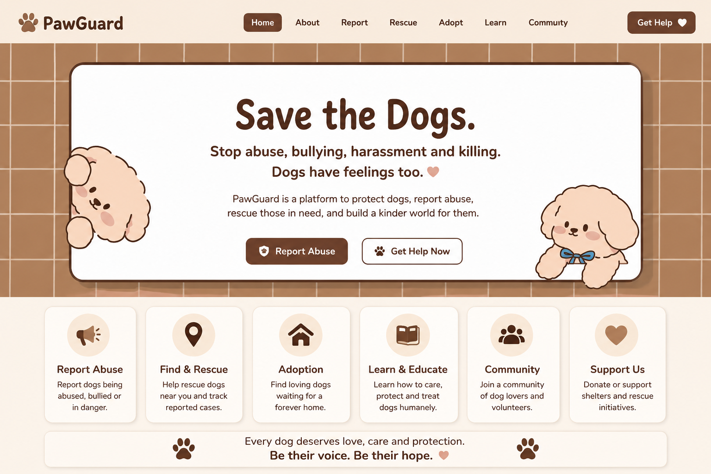

# 🐾 PawGuard — Protect Dogs, They Have Feelings Too

<div align="center">
  
  
  <p align="center">
    <strong>A compassionate platform to report dog abuse, rescue dogs in danger, find loving adoptions, reunite lost pets, and build a kinder world for every canine.</strong>
  </p>
</div>

---

## 🌟 Key Features

### 🐶 1. Animated Interactive Hero & Companions
- Recreated directly from the original design with responsive terracotta tile layout.
- **Teddy** (Left Peeking Puppy) and **Oliver** (Right Bowtie Puppy) feature lifelike SVG animations:
  - Natural breathing and head-tilting movements
  - Dynamic blinking and winking
  - Interactive petting, biscuit treats (`🦴`), tennis ball play (`🎾`), and heart reactions (`💖`)
  - Synthesized audio puppy barks and effects using the Web Audio API (zero external sound dependencies)

### 🚨 2. Dog Abuse & Danger Reporting System
- **Incident Categorization**: Physical Abuse, Severe Chaining, Starvation/Neglect, Abandonment, Dog Fighting, and Hit-and-Run.
- **Urgency Levels**: Critical (🔴), High Urgency (🟠), and In Progress (🟡).
- **Location Finder**: Instant GPS geolocation detection and street landmark notes.
- **Evidence Uploader**: Live photo/video preview with timestamp verification.
- **Anonymous Reporting Toggle**: Protects whistleblower and eyewitness identity.
- **Automated Dispatch Simulator**: Generates unique tracking Case IDs (e.g. `PG-RESCUE-8942`) and alerts nearby volunteer units.

### 🗺️ 3. "Find & Rescue" Live Radar & Tracking Map
- Interactive case list and live mission radar.
- Real-time status tracker: *Reported → Responder En Route → Under Vet Care → Safely Rescued*.
- One-click **"Volunteer for This Rescue"** button allowing community members to accept missions.
- Direct GPS route directions and incident sharing.

### 🏡 4. Adoption & Foster Gallery
- Comprehensive profiles with personality badges, rescue histories, and medical statuses.
- Filter by size (Small, Medium, Large) and temperament (Kid-friendly, Cat-friendly).
- Interactive **"Adopt Me"** application form with meet-and-greet scheduler.
- **"Virtual Sponsor"** option to fund veterinary care and food.

### 🔍 5. Lost, Abandoned & Injured Dogs Noticeboard
- Real-time community alert board for missing pets, found strays, and injured animals.
- **Printable Missing Dog Poster Generator**: Instant formatted PDF/flyer with reward tags and tear-off contact information.

### 📚 6. Humane Education & Canine Welfare Hub
- **Canine Body Language Decoder**: Identifying subtle stress, whale eyes, and silent pain signals.
- **Legal Guide**: Animal cruelty laws, tethering violations, and lawful evidence collection.
- **Emergency First-Aid Protocols**: Heatstroke, toxin ingestion, fractures, and CPR.
- **"Dog-Smart Hero" Interactive Quiz**: Real-time knowledge scoring and certification.

### 👥 7. Community & Volunteer Guild
- Volunteer roles: Rescue Drivers, Foster Sanctuaries, Field Spotters, and Vet Techs.
- Live **Volunteer Leaderboard** and verified rescue updates stream.
- Volunteer sign-up form with automated regional enrollment.

### 💖 8. Lifesaving Medical Fund & Donations
- Live progress tracker for emergency veterinary surgical funds.
- Transparent impact tiers ($15 food kits, $35 vaccines, $75 triage, $150 surgeries).

### 📞 9. 24/7 Emergency SOS Hotline
- Instant access to toll-free animal cruelty hotlines, poison control, and 1-click emergency SOS broadcast.

---

## 🛠️ Technology Stack

- **Framework**: React 18 with TypeScript
- **Bundler**: Vite 6
- **Styling**: Tailwind CSS & Vanilla CSS Design System with custom keyframe animations
- **Icons**: Lucide React
- **Audio Engine**: Web Audio API (Synthesized oscillators)
- **Effects**: Canvas Confetti

---

## 🚀 Local Development

```bash
# 1. Clone the repository
git clone https://github.com/comzzy-comzzy/PawGuard.git

# 2. Navigate to project directory
cd PawGuard

# 3. Install dependencies
npm install

# 4. Start local development server
npm run dev
```

The app will be available at `http://localhost:3000`.

---

## 🌐 Deploying to Vercel

1. Import the repository `comzzy-comzzy/PawGuard` on [Vercel](https://vercel.com).
2. Framework Preset: **Vite**
3. Build Command: `npm run build`
4. Output Directory: `dist`
5. Click **Deploy**!

---

<div align="center">
  <p><strong>Every dog deserves love, care and protection. Be their voice. Be their hope. 🤎</strong></p>
</div>
